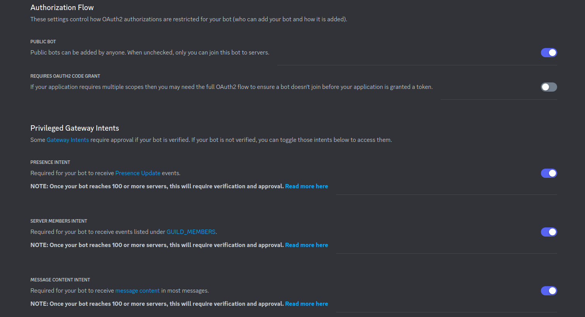
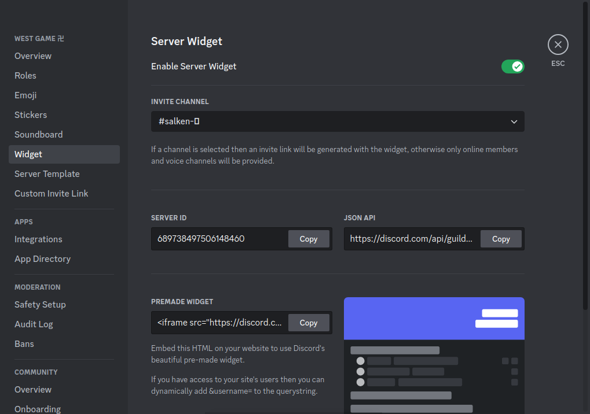

<center>

<p align="center">
    
    
</p>

<center>
    <h4>One-Time invite link generator for your Discord server with webpage, which supports Discord AI chatbot powered by OpenAI language model called GPT-3.5.</h4>
</center>

<center>
<a href="https://www.buymeacoffee.com/agcrisbp" target="_blank"></a>
<a href="https://saweria.co/agcrisbp" target="_blank"></a>
<a href="https://github.com/sponsors/agcrisbp" target="_blank"></a>
</center>

---

## Live Demo:

You can check [WEST GAME 卍 Server](https://west.fly.dev).

---

## Features

- Self commands for bot owners only to retrieve the logs, and clean the logs.
- Welcome message. Check [bot.js](bot.js) line 243.
- Currently, I have no ideas.

---

## Self Commands for Bot Owners

- !help: You know what is it for.
- !log: Retrieve the GPT-3.5 logs.
- !clean: Clean all bot logs.

---

## Create Discord Application

- Go to the [Discord Developer Portal](https://discord.com/developers/applications) and create a new application.

- Navigate to the "Bot" tab and click "Add Bot" to create a bot user.

- Under the "Bot" tab, you'll find the token. Copy this token; [.env](.env).

- Still under the "Bot" tab, set the **Authorization Flow** and **Privileged Gateway Intents** to this:



- Now, go to the "OAuth2" tab, in the "OAuth2 URL Generator" section, select the "bot" scope and as whatever you want.

- Copy the generated URL and paste it into your browser. This will allow you to invite the bot to your server.

---

## Create an OpenAI APi Key

- Visit the [OpenAI website](https://openai.com) and create an account. Follow the registration process to set up your account.
- Navigate to [API Section](https://platform.openai.com/apps) of the OpenAI platform.
- Locate the [API key generation section](https://platform.openai.com/api-keys) on the OpenAI platform and follow the instructions to generate your key and copy to; [.env](.env).

---

## Installation

- [Fork this repo](https://github.com/agcrisbp/AD-GPT3/fork) or clone:
```bash
git clone https://github.com/agcrisbp/AD-GPT3
```

- Install the dependencies:

```bash
npm install
```

- Preview

```bash
node bot.js
```

---

## Setup Server Invitation Web

- Go to your `Server Settings > Widget > Copy JSON API`.



- Go to [script.js](public/script.js) and replace _"https://discord.com/api/guilds/1198288601696440350/widget.json"_ with the link you just copied.

- Edit lines of **index.html** in `<head>` section with your server data.

- Setup the `.env.example` and rename it to `.env`.

---

## Deploy To https://fly.io

- Install the flyctl package: [Install flyctl](https://fly.io/docs/hands-on/install-flyctl/).

- Setup fly app:

```bash
flyctl auth login
```

- Launch the app:

```bash
flyctl launch
```

```bash
? Would you like to copy its configuration to the new app? Yes
```

```bash
? Do you want to tweak these settings before proceeding? Yes
```

- Set the app name based on your `app = "YourAppName"` in [fly.toml](fly.toml).

- Deploy:

```bash
flyctl deploy
```

> Next time you want to redeploy your web after editing something, just use `flyctl deploy`.

---

> fly.io will run 2 machines automatically, if it makes run your bot into 2 at once, stop & destroy one of them:

```bash
flyctl machine stop
```

- Destroy:

```bash
flyctl machine destroy
```

---

#### Credits:

- [0xe2d0](https://github.com/0xe2d0).
- [Ed0ardo](https://github.com/Ed0ardo).
